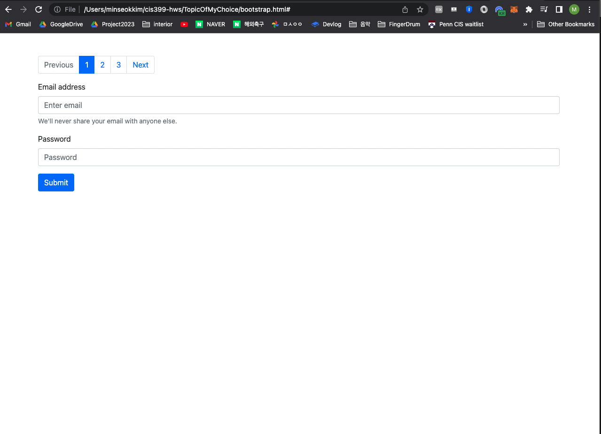

# Technology

I am going to teach myself about Bootstrap.

# Rationale: 
For the project, I need to work on efficiently building UIs for login/signup. I also need
a page that can scroll horizontally, and thus need to learn about pagination

# Tutorial: 
https://www.w3schools.com/bootstrap4/default.asp

# Video of my result: 

It is replaced with an image of the working website.

